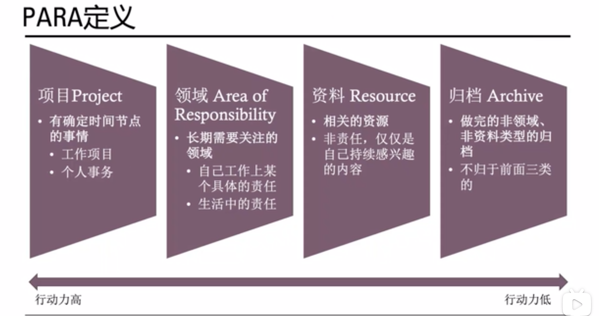

- 定义
	- [PARA--资料整理神器简介_哔哩哔哩_bilibili](https://www.bilibili.com/video/BV1r94y1o7Nr)
		- 
	-
- PARA笔记法
	- [人的能力有限 除非你有個「第二腦袋」. 我們既然不會和汽車比速度，和超重機比力量，我們也不應和電腦比聰明、比快捷；要把電… | by 一燈大叔 | Medium](<a href="https://medium.com/@uncleonelight/%E4%BA%BA%E7%9A%84%E8%83%BD%E5%8A%9B%E6%9C%89%E9%99%90-%E9%99%A4%E9%9D%9E%E4%BD%A0%E6%9C%89%E5%80%8B-%E7%AC%AC%E4%BA%8C%E8%85%A6%E8%A2%8B-c9a9f0fcb6d7">https://medium.com/@uncleonelight/%E4%BA%BA%E7%9A%84%E8%83%BD%E5%8A%9B%E6%9C%89%E9%99%90-%E9%99%A4%E9%9D%9E%E4%BD%A0%E6%9C%89%E5%80%8B-%E7%AC%AC%E4%BA%8C%E8%85%A6%E8%A2%8B-c9a9f0fcb6d7</a>)
	  collapsed:: true
		- [人的能力有限 除非你有個「第二腦袋」. 我們既然不會和汽車比速度，和超重機比力量，我們也不應和電腦比聰明、比快捷；要把電… | by 一燈大叔 | Medium](<a href="https://medium.com/@uncleonelight/%E4%BA%BA%E7%9A%84%E8%83%BD%E5%8A%9B%E6%9C%89%E9%99%90-%E9%99%A4%E9%9D%9E%E4%BD%A0%E6%9C%89%E5%80%8B-%E7%AC%AC%E4%BA%8C%E8%85%A6%E8%A2%8B-c9a9f0fcb6d7">https://medium.com/@uncleonelight/%E4%BA%BA%E7%9A%84%E8%83%BD%E5%8A%9B%E6%9C%89%E9%99%90-%E9%99%A4%E9%9D%9E%E4%BD%A0%E6%9C%89%E5%80%8B-%E7%AC%AC%E4%BA%8C%E8%85%A6%E8%A2%8B-c9a9f0fcb6d7</a>) #[[Roam-Highlights]]
			- 刷了兩遍三季的《Westworld》後，隱隱然有種危機感 — — __不久將來，文字寫作者的最大競爭對手不是別的作家，而是有人工智能的「寫作機器人」__。
			- 要在未來世界存活，必需具備兩方面的能力，首先是
			- **平台思維**
			- ，懂得借助科技來整合資源，因為未來的成功企業將不再只是提供產品或服務，而是提供平台來撮合交易，像Uber, Spotify, Amazon, Netflix等等。
			- 第二就是
			- **學習能力**
			- ，因為科技發展得太快，我們在學校學到的知識，出來社會工作時已經過時了，不主動地、終生地學習，任何時候都可能被時代淘汰。而跨領域的學習能力，比專業學習更重要，因為專業與專業之間的界線越來越模糊。
			- 要把電腦以至 AI 當成工具，處理我們不想處理的事，藉此
			- **空出我們腦袋的「處理能力」，去做我們人類最擅長，AI暫時仍未能取代的事情 — — 創作**
			- 。
			- 為了好好培養上述的能力，我們需要一個「第二腦袋」。
			- **建立第二個腦袋（Building a Second Brain）**
			- 其實非常的簡單，不過是：
			- **在你肉身的腦袋以外，建立一個可靠的系統，用以儲存、整理、消化資訊，最終產出優秀的創意。**
			- 第二腦袋這系統的主要的功能是
			- **C.O.D.E**:
			- &lt;h2&gt;**收集(Collect)**&lt;/h2&gt;
			- &lt;h2&gt;**整理(Organise) 、過濾(Distill)及表達(Express)**&lt;/h2&gt;
				- 「
				- **卡片盒筆記法**
				- 」（
				- __Zettelkasten__）裡，和大家分享過一種用「
				- __連結__」及「
				- __以自己文字紀錄__」為主軸的知識系統。
				- 「卡片盒筆記法」比較擅長處理
				- **文字創作**
				- 、
				- **論文寫作**
				- 等較為學術性、文字性的想法和資訊。
	- [搞不定資料分類? PARA方法助你快速整理筆記【第二腦袋#2】. 我挺相信「塞翁失馬，焉知非福」的。 | by 一燈大叔 | Medium](https://medium.com/@uncleonelight/%E6%90%9E%E4%B8%8D%E5%AE%9A%E8%B3%87%E6%96%99%E5%88%86%E9%A1%9E-para%E6%96%B9%E6%B3%95%E5%8A%A9%E4%BD%A0%E5%BF%AB%E9%80%9F%E6%95%B4%E7%90%86%E7%AD%86%E8%A8%98-%E7%AC%AC%E4%BA%8C%E8%85%A6%E8%A2%8B-2-9aa71f680186)
	- [親測好用：以PARA大法重整積壓十年的筆記【第二腦袋#3】. 以前老是糾結要不要棄用Evernote，換成其他更花俏、更多功能的筆記軟件，自從… | by 一燈大叔 | Medium](https://medium.com/@uncleonelight/%E8%A6%AA%E6%B8%AC%E5%A5%BD%E7%94%A8-%E4%BB%A5para%E5%A4%A7%E6%B3%95%E9%87%8D%E6%95%B4%E7%A9%8D%E5%A3%93%E5%8D%81%E5%B9%B4%E7%9A%84%E7%AD%86%E8%A8%98-%E7%AC%AC%E4%BA%8C%E8%85%A6%E8%A2%8B-3-4fdfee0901f1)
	- [用流行的筆記軟件 實行卡片盒筆記方法【卡片盒筆記法#4】. 在搜集資料的過程中，發現港台的中文媒體如Matters和方格子上比較少人討論筆記… | by 一燈大叔 | Medium](https://medium.com/@uncleonelight/%E7%94%A8%E6%B5%81%E8%A1%8C%E7%9A%84%E7%AD%86%E8%A8%98%E8%BB%9F%E4%BB%B6-%E5%AF%A6%E8%A1%8C%E5%8D%A1%E7%89%87%E7%9B%92%E7%AD%86%E8%A8%98%E6%96%B9%E6%B3%95-%E5%8D%A1%E7%89%87%E7%9B%92%E7%AD%86%E8%A8%98%E6%B3%95-4-1a9e9f40fe03)
	- [一燈大叔 – Medium](<a href="https://medium.com/@uncleonelight">https://medium.com/@uncleonelight</a>)
-
-